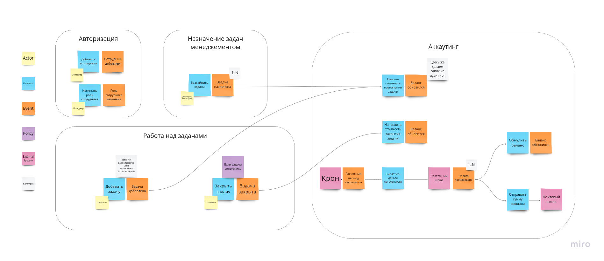
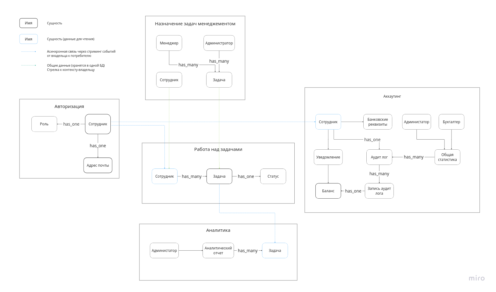

# Awesome Task Exchange System (aTES) для UberPopug Inc (v1)

### Бизнес-события

- **ЗадачаНазначена** - возникает при создании сотрудником задачи. 
  Содержит:
  - указатель на задачу
  - исполнитель
- **ЗадачаЗакрыта** - возникает при закрытии сотрудником задачи. 
  Содержит:
  - указатель на задачу
- **БалансОбновился** - возникает при изменении баланса сотрудника.
  Содержит:
  - указатель на сотрудника
  - новое значени баланса
- **РассчетныйПериодЗакончился** - возникает в конце рабочего дня, запускает расчет и выплаты по сотрудникам
- **ВыплатаРассчитана** - возникает после рассчета выплаты сотрудника, если сумма выплаты больше 0
  Содержит:
  - указатель на сотрудника
  - сумма выплаты
- **ОплатаПроизведена** - возникает после оплаты сотруднику. 
  Содержит:
  - указатель на сотрудника
  - сумму выплаты

## Модель данных

### Общие данные

Домен "Назначение задач менеджментом" и "Работа над задачами" хранят сотрудников и задачи в общей БД

**Задача**

Владелец данных: домен работы над задачами
Состоит из: описания, статуса, цены назначения, цены закрытия
Передается в другие домены через CUD событие: ЗадачаСоздана

**Сумма выплаты**

**Баланс**

**Адрес почты**

## Разделение на сервисы